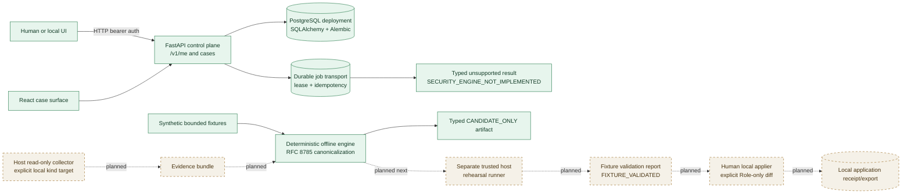

# Counterseal

Counterseal is a research prototype for **evidence-bound, fixture-scoped
Kubernetes RBAC remediation validation**. It is designed to make a narrow
question reviewable: whether a proposed change to a dedicated namespaced
`Role` can be validated against an explicitly owned local kind fixture before a
human decides whether to apply it locally.

> **Public status: `FIXTURE_VALIDATED` — NOT PRODUCTION ASSURANCE.**
>
> This status describes a bounded fixture result when the required evidence is
> present. It is not a production-safety, containment, authorization, or
> compliance claim. Counterseal is not an autonomous remediation system and
> does not make production or remote-cluster changes.

## Current boundary

The repository currently contains **Phase 0 (architecture)**, **Phase 1 (core
control plane)**, and the offline portion of **Phase 2 (deterministic engine)**:

- HTTP bearer authentication with hash-only token storage and role checks;
- a SQLAlchemy persistence layer with Alembic migrations;
- PostgreSQL as the deployment database, with SQLite retained only as a test
  accelerator;
- durable, idempotent job transport with leases, heartbeats, and explicit
  unsupported completion;
- a React case-creation surface backed by the case contract;
- metadata-only audit normalization and contract-scoped read observations;
- snapshot-scoped, additive RBAC permission analysis and typed-claim checks; and
- a bounded compiler for the three namespaced-`Role` narrowing candidates.

The Phase 2 engine is **offline and fixture-driven only**. It accepts bounded
caller-supplied metadata and typed records; it does not collect evidence,
connect to Kubernetes, rehearse a change, call a model, or apply a manifest. A
queued Phase 1 investigation job remains transport, not validation: it
completes only as `UNSUPPORTED` with `SECURITY_ENGINE_NOT_IMPLEMENTED`.
Case creation and a status label do not create evidence or imply a Kubernetes
operation was analyzed.

The current HTTP control-plane contract is intentionally small:

| Surface | Purpose | Boundary |
| --- | --- | --- |
| `GET /v1/me` | Return the authenticated local principal | HTTP bearer token required |
| `GET /v1/cases` and `GET /v1/cases/{id}` | Read case metadata | No evidence collection |
| `POST /v1/cases` | Create a case with title and description | Case starts in `NEEDS_EVIDENCE` |
| `POST /v1/cases/{id}/investigations` | Enqueue a typed investigation job | Always unsupported until the offline engine is connected to an evidence workflow |
| `/v1/workers/jobs/*` | Claim, heartbeat, and complete a leased job | Transport only; no engine authority |
| `/healthz`, `/readyz` | Process/database liveness checks | Not a validation result |

Check [`docs/STATUS.md`](docs/STATUS.md) for the lead-maintained verification
record. Documentation must distinguish what exists in the tree, what was
actually run, and what is planned.

## Intended V1 scope

V1 is deliberately narrower than a general Kubernetes automation product:

1. **Target:** one explicitly selected, developer-owned local kind cluster.
2. **Collection:** a host-side, read-only collector with explicit target and
   context identity. It must not silently use an ambient or remote context.
3. **Objects:** RBAC observations may include the relevant `Role`, bindings,
   and subject relationships so that effective permissions are not guessed.
4. **Candidate:** an editable, dedicated **namespaced `Role`** only. The
   allowed candidate transformations are removing secret access, removing
   `list`/`watch`, and restricting a named `get` with `resourceNames`.
5. **Excluded changes:** no binding changes, no permission widening, no
   cluster-scoped role edits, no generic manifests, and no unrelated resource
   mutations.
6. **Rehearsal:** a separate trusted host rehearsal runner will compare bounded
   baseline and candidate permission observations. The runner is not an
   applier.
7. **Application:** a human local applier may be considered only after the
   engine, evidence, and rehearsal gates are real. A model, digest, status, or
   approval-shaped field is never application authority.

Kubernetes RBAC permissions are additive. Removing a rule from one dedicated
`Role` cannot prove that another binding does not grant the same access; an
effective-permission result must account for that uncertainty and abstain when
it cannot be bounded.

Counterseal is **not** containment, production safety, autonomous remediation,
cloud IAM, a remote-cluster operator, a generic manifest applier, or a
replacement for Kubernetes authorization and audit controls.

## Status and workflow are different

The public report/status vocabulary describes what evidence supports. The
workflow vocabulary describes where a case is in its process. They must not be
collapsed:

| Public report status | Meaning in this prototype |
| --- | --- |
| `OBSERVED` | A source or fixture observation is recorded. |
| `DERIVED` | A deterministic derivation is linked to observations. |
| `BASELINE_REPRODUCED` | A baseline fixture result was reproduced. |
| `FIXTURE_VALIDATED` | The bounded fixture validation evidence passed its defined checks; **not production assurance**. |
| `CANDIDATE_ONLY` | A candidate diff exists without a validation verdict. |
| `LAB_APPROVED` | A human approved a lab/local candidate; it is not production approval. |
| `APPLIED_LOCAL` | A human local application receipt exists. |
| `INCONCLUSIVE`, `STALE`, `UNSUPPORTED` | The evidence or preconditions do not support a stronger result. |

Workflow state is stored separately from the report status. In Phase 1 a newly
created case is `NEEDS_EVIDENCE`; investigation jobs remain transport records
and are `UNSUPPORTED` until the offline engine is connected to a future
evidence workflow.

## Architecture at this checkpoint

Solid nodes are current Phase 0–2 boundaries. Dashed nodes are planned and do
not represent available cluster commands or integrations.



The path is intentionally split: the current engine derives from synthetic
bounded inputs, the future collector reads, the future runner rehearses, and a
human applier performs any later local change. No offline engine output is an
authorization or application instruction.

## Repository map

```text
src/counterseal/
  domain/                  versioned records, status vocabulary, digests
  engine/                  offline audit, RBAC, claims, policy, and compiler
  backend/                 HTTP auth, FastAPI routes, SQLAlchemy repositories
    db/                    models, sessions, repositories
apps/web/                  React/Vite case surface
alembic/                   database migrations (the canonical migration tree)
tests/                    Python tests for domain, Phase 1, and Phase 2 offline behavior
docs/
  architecture.md         current/planned boundary map
  IMPLEMENTATION_PLAN.md   Phase 0–10 objectives and gates
  adr/                     scope and backend layout decisions
  operators/               local control-plane guide (lead-owned setup/results)
  research/                concise primary-source related-work review
  threat-model/            implemented controls and planned controls
```

The backend intentionally lives under `src/counterseal/backend`; migrations
intentionally live under `alembic`. There are no placeholder `apps/api` or
`migrations` trees.

## Quickstart entry point

Use the [local control-plane operator guide](docs/operators/local-control-plane.md)
for environment setup, migration commands, local token handling, and any
verified run record. That guide is the authority for setup details. It must not
describe a working end-to-end cluster validation workflow: the current engine
is an offline fixture path only.

To run the deterministic synthetic candidate smoke demo:

```text
make phase2-offline
```

Its output is `CANDIDATE_ONLY` compilation material, not a rehearsal verdict,
authorization decision, or production-safety result.

The README does not provide a pretend cluster command. Do not point the current
code at a production, shared, or remote cluster, and do not treat a successful
health check or case creation as RBAC validation.

## Canonicalization and integrity

The deterministic engine is required to use [RFC 8785 JSON Canonicalization
Scheme](https://www.rfc-editor.org/rfc/rfc8785) for material whose digest is
used to compare evidence, candidates, or reports. Canonicalization makes a
representation repeatable; a bare SHA-256 digest is not a signature, identity
proof, freshness proof, or authorization decision. A digest is meaningful only
when the covered material, algorithm, trusted source, and verification context
are explicit.

Phase 1 metadata audit rows are append-only at the database boundary where
configured. That does not make the database independently trusted, and it is
not a cryptographic hash chain. See the [threat model](docs/threat-model/THREAT_MODEL.md)
for the limits of digests and chained metadata.

## Development and security

- Read [`CLAUDE.md`](CLAUDE.md) before changing implementation or docs.
- Use the [implementation plan](docs/IMPLEMENTATION_PLAN.md) as the phase gate.
- Keep unsupported inputs and missing evidence as `UNSUPPORTED`, `STALE`,
  `INCONCLUSIVE`, `abstained`, or `failed` as appropriate; never infer a pass.
- Read [`SECURITY.md`](SECURITY.md) before reporting a security concern.
- Contribution, conduct, governance, history, and attribution documents are
  available at [`CONTRIBUTING.md`](CONTRIBUTING.md),
  [`CODE_OF_CONDUCT.md`](CODE_OF_CONDUCT.md), [`GOVERNANCE.md`](GOVERNANCE.md),
  [`CHANGELOG.md`](CHANGELOG.md), and [`NOTICE`](NOTICE).

No test, integration, benchmark, screenshot, security review, or production
assurance result is claimed here. Actual verification belongs in
[`docs/STATUS.md`](docs/STATUS.md).

The repository includes the Apache-2.0 `LICENSE` and a `NOTICE` attribution
file. Dependency and third-party asset licensing still requires review before
redistribution or a formal release.
