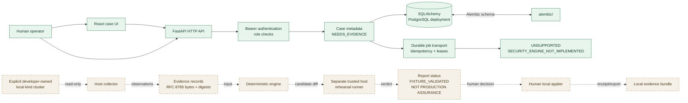

# Counterseal architecture

**Date:** 2026-09-28
**Status:** Phase 0 architecture; Phase 1 core is the active implementation
boundary.

Counterseal is a research prototype for evidence-bound, fixture-scoped
Kubernetes RBAC remediation validation. The architecture deliberately keeps
four responsibilities separate:

1. a control plane records local case metadata and transports typed jobs;
2. a host collector reads an explicitly selected local kind fixture;
3. a deterministic engine derives a bounded candidate and compares evidence;
4. a separate trusted host runner rehearses the candidate, after which a human
   may make a local application decision.

The current implementation ends at the first responsibility. Dashed components
below are planned boundaries, not available integrations.

## Current and planned data flow



## Phase 0/1 control plane

The implemented backend layout is compact and intentional:

- `src/counterseal/backend/auth.py` contains hash-only bearer-token primitives
  and role-aware principals.
- `src/counterseal/backend/dependencies.py` binds HTTP bearer authentication
  and role checks to FastAPI routes.
- `src/counterseal/backend/routes.py` exposes `/v1/me`, case reads/creation,
  investigation enqueue, and worker claim/heartbeat/complete routes.
- `src/counterseal/backend/db/models.py` defines users, token metadata, cases,
  jobs, and metadata audit rows.
- `src/counterseal/backend/db/repositories.py` owns transactional case,
  token, audit, and lease operations.
- `alembic/` is the migration source of truth. It is not duplicated under a
  generic `migrations/` directory.
- `apps/web/` is the React/Vite case surface. It is a review and case-creation
  surface, not a Kubernetes client.

The deployment database is PostgreSQL. SQLite is retained only to accelerate
isolated tests. A successful database readiness response means that the control
plane can reach its configured schema; it does not mean that a fixture was
collected or validated.

### Job transport boundary

The job table provides durable transport mechanics: request fingerprinting,
idempotency, claim leases, heartbeats, retries through lease expiry, and a
terminal unsupported receipt. The investigation job kind is intentionally typed
even though its engine is absent. A worker must not invent a result. Until the
deterministic engine exists, completion is:

```text
status: COMPLETED
outcome: UNSUPPORTED
reason: SECURITY_ENGINE_NOT_IMPLEMENTED
```

This makes transport useful for integration work without disguising an empty
engine as security validation.

## Planned V1 validation path

### Read-only collection

The host collector will require an explicit context and a positive local-kind
check. It will read the bounded RBAC surface needed to answer a declared
permission question and will preserve:

- cluster and context identity;
- namespace, subject, API group, resource/subresource, verb, and resource name;
- observed Role and binding relationships;
- capture time with an explicit offset; and
- canonical evidence bytes and digests.

The collector will not create, patch, apply, delete, bind, impersonate, or
escalate. Ambiguous locality, unsupported API shapes, API errors, incomplete
evidence, and target mismatch produce an abstention or failure.

### Deterministic candidate scope

The engine will accept only a dedicated namespaced `Role` and a declared
workload permission question. Its candidate transformations are limited to:

- removing access to `secrets`;
- removing `list` and `watch`; and
- restricting a named `get` through `resourceNames`.

It will reject bindings changes, permission widening, cluster-scoped roles,
arbitrary manifests, and unrelated objects. Because Kubernetes RBAC grants are
additive, a Role diff cannot by itself prove absence of an effective grant from
another binding. The engine must retain that limitation and abstain when the
declared question cannot be answered from bounded evidence.

### Rehearsal and local application

The rehearsal runner is a separate trusted host process. It consumes the
collector's evidence and the engine's candidate, then performs bounded,
read-only baseline/candidate probes against the explicitly owned fixture. It
does not hold an applier command or silently use the operator's ambient
context.

If a later phase permits application, a human local applier will re-check the
target identity, Role identity, exact candidate digest, and current resource
version before applying the narrow diff. The applier will not modify bindings,
widen permissions, or accept generic manifests. It will emit an explicit local
receipt or an abstained/failed result.

## Status model

Report status and workflow state are separate data:

```text
report status:  OBSERVED | DERIVED | BASELINE_REPRODUCED |
                FIXTURE_VALIDATED | CANDIDATE_ONLY | LAB_APPROVED |
                APPLIED_LOCAL | INCONCLUSIVE | STALE | UNSUPPORTED

workflow state: Phase-specific case/queue state, such as NEEDS_EVIDENCE,
                QUEUED, LEASED, or COMPLETED.
```

`FIXTURE_VALIDATED` is the strongest intended fixture result for the bounded
path and must always be accompanied by **NOT PRODUCTION ASSURANCE**. A queue
state, model response, digest, or approval-shaped record cannot promote a
report status.

## Trust assumptions and limits

- The local host, its filesystem, the database owner, and the later trusted
  runner are explicit trust assumptions, not properties Counterseal proves.
- Bearer authentication identifies a local control-plane principal; it does
  not establish Kubernetes identity or grant Kubernetes permission.
- Database append-only triggers reduce accidental audit-row mutation but do not
  defend against a privileged database owner, deletion of the database, replay,
  or loss of availability.
- Canonicalization and SHA-256 detect changed covered bytes when the expected
  digest is trusted. They do not provide signatures, key management,
  freshness, or non-repudiation.
- A model may summarize or suggest. It may not choose a target, alter a diff,
  approve a plan, or apply a Role.

See [`docs/threat-model/THREAT_MODEL.md`](threat-model/THREAT_MODEL.md),
[`docs/adr/ADR-0001-v1-scope.md`](adr/ADR-0001-v1-scope.md), and
[`docs/adr/ADR-0002-backend-layout.md`](adr/ADR-0002-backend-layout.md) for
the decision records behind these boundaries.
